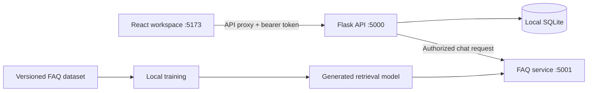

# How VynixHR works

## Responsibilities

- React owns presentation, forms, navigation, and request feedback. Persistent HR state belongs to the API and database.
- Flask validates requests, checks sessions and HR roles, enforces ownership, and stores people and workflow records through SQLAlchemy.
- The local AI service retrieves an answer from reviewed demo policies. It does not execute instructions, change employee records, or access payroll.
- SQLite runs in the backend process. The database survives restarts and is never uploaded to GitHub.
- `start.py` manages dependencies and process lifecycles. It waits for each service to become healthy and stops only its own child processes.

## Data and workflow decisions

Employee deletion is a soft archive so linked attendance and leave history remain available. Demo seeding adds missing records without replacing user edits. Leave and attendance actions are validated on the server. Ordinary accounts are distinct from HR administrators, and task access is scoped to the authenticated owner.

The FAQ corpus is versioned; generated model files are reproducible build artifacts. Responses expose their source so someone can check the policy. Unknown and sensitive personal questions receive a fallback. This model uses text similarity, so ambiguous phrasing may need clarification and the sample evaluation cannot establish real-world accuracy.

## Local scope

The launcher binds services to loopback and uses development servers. This is a working local portfolio application, not a deployment architecture for employee data. A real rollout needs organization-specific policies, identity provisioning, a production server, HTTPS, monitoring, backups, and a migration/deployment plan.

The existing task API and its Swagger documentation are preserved. New HR endpoint details are in `backend/README.md`; AI endpoint details are in `ai/README.md`.
